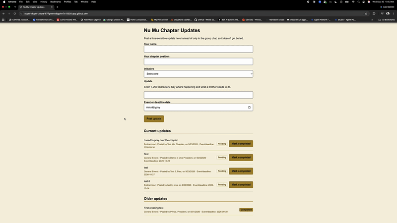
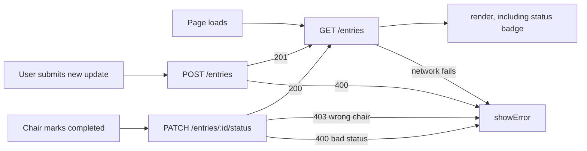
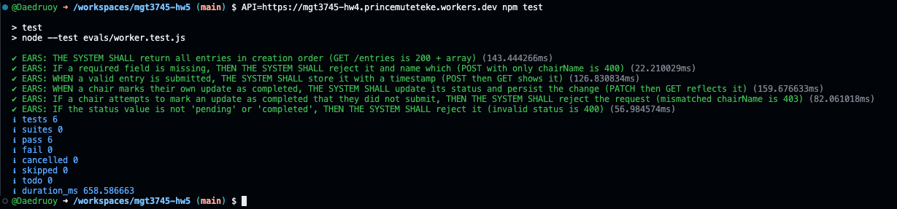

# Entries: The First Delegated Feature

## What

HW4 repository: [https://github.com/Daedruoy/mgt3745-hw4](https://github.com/Daedruoy/mgt3745-hw4)

This is a chapter management tool for Nu Mu, the Georgia Tech chapter of Alpha Phi Alpha Fraternity, Inc. This week's feature is F-07 from [FEATURES.md](context/FEATURES.md): a chair marks their own time-sensitive update as completed, and the status displays alongside the update for any brother viewing the page, so the secretary or president no longer needs to follow up individually to know what's been handled. See [PROJECT.md](context/PROJECT.md) for the full wicked problem this addresses. Data continues to live in Cloudflare D1, per [ADR-002](context/ARCHITECTURE.md); this week added one new endpoint, `PATCH /entries/:id/status`, to persist status changes there rather than inventing a separate storage mechanism.

## See It Work

## How to Run

Deployed: `https://mgt3745-hw4.princemuteteke.workers.dev/entries`

From a fresh Codespace:

1. Open the repository in a Codespace. The devcontainer installs xdg-utils and runs `npm install`.
2. `npx wrangler login --device`, then follow [docs/SESSION_B_COMMANDS.md](docs/SESSION_B_COMMANDS.md) to create the database, run the schema, and deploy.
3. Paste the deployed URL into `app.js` as `API`.
4. Right-click `index.html`, choose **Open with Live Server**.

Run the code eval: `API=https://mgt3745-hw4.princemuteteke.workers.dev npm test`

To run the Worker locally instead: `npm run dev` (port 8787, local D1 emulator).

## Status

| Feature | EARS statement | Verdict |
|---|---|---|
| Save an entry | WHEN a valid entry is submitted, THE SYSTEM SHALL store it with a timestamp | PASS |
| Reject incomplete entry | IF a required field is missing or empty, THE SYSTEM SHALL reject it and name which | PASS |
| Survive cleared cache | Data persists in D1 and is retrievable after browser storage is cleared | PASS |
| Chair marks own update completed | WHEN a chair marks their own update as completed, THE SYSTEM SHALL update its status and persist the change | PASS |
| Status displays with each update | WHEN a brother views the resource, THE SYSTEM SHALL display each update's status | PASS |
| Reject a non-owner's status change | IF a chair attempts to change status on an update they did not submit, THE SYSTEM SHALL reject the request | PASS |
| New endpoint uses bind() | WHEN the status request reaches the Worker, THE SYSTEM SHALL persist it via bind() | PASS |
| Two-week / older-updates split | Items split by submission recency into Current and Older sections | CANNOT TEST YET |
| Server unreachable | IF the server is unreachable, THE SYSTEM SHALL tell the user | CANNOT TEST YET |
| Server returns 500 | THE SYSTEM SHALL show a readable error rather than crash | CANNOT TEST YET |
| Two clients, one table | Simultaneous writes/edits to the same entry are handled without corruption | DEFERRED (ADR-002) |
| Reminder flag, acknowledgment tracking, digest view, complete-details checklist (F-03, F-04, F-05, F-06) | Out of scope for HW3–HW5 builds | DEFERRED (ADR-001) |

Full verification table lives in [FEATURES.md](context/FEATURES.md). Code eval: 6 of 6 tests passing. Judgment eval: 10 of 10 questions, two graders, 100% agreement (see [JUDGMENT.md](docs/JUDGMENT.md)).

## Delegation

- [DDR-001](docs/DDR-001.md): F-07 delegated to bolt.new, then to Google AI Studio (Gemini 3.8 Flash) for comparison. Estimated build-by-hand: 1 to 1.5 hours. Actual review time after delegation: roughly 2 hours. Net: negative, this delegation cost more time than it saved, and the DDR says so directly.
- [DDR-002](docs/DDR-002.md): the HW4 Copilot delegation (the `RETURNING` clause in the Worker's INSERT statement), written up properly this week.
- [Comparison note](docs/COMPARISON.md): bolt.new vs. AI Studio on the same F-07 prompt.

## Links

Reading order for a stranger: [PROJECT.md](context/PROJECT.md) → [USERS.md](context/USERS.md) → [FEATURES.md](context/FEATURES.md) → [ARCHITECTURE.md](context/ARCHITECTURE.md) → [STANDARDS.md](context/STANDARDS.md) → [TOOLS.md](context/TOOLS.md) → [STYLE.md](context/STYLE.md) → [EVALS.md](context/EVALS.md) → [SKILLS.md](context/SKILLS.md) → [CLAUDE.md](context/CLAUDE.md)

## AI Use

Every delegation has a DDR under Delegation above. In short: bolt.new was given the same context and asked to build F-07 within three named files; it fabricated a client-side status-marker workaround rather than flag that the feature's EARS rows actually required a new server endpoint, and it made unauthorized test writes to the live production Worker in the process (documented and cleaned up, see DDR-001). The real fix, a hand-written `PATCH /entries/:id/status` endpoint with a soft ownership check, was built after reviewing bolt's failure, not delegated. Google AI Studio was then given the identical prompt for comparison; it found the real endpoint by probing the live Worker with guessed URL paths, also mutating production data along the way, and also ran an unrequested web search despite Grounding being disabled (see [COMPARISON.md](docs/COMPARISON.md)). A separate DDR (DDR-002) documents a Copilot delegation from HW4 that wasn't formally recorded at the time.

Hours spent on this assignment: 9 hours.